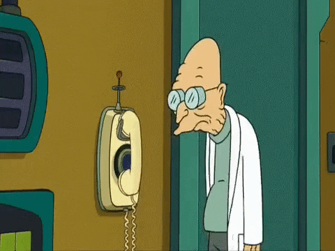

# <h1 align="center">:tada: Welcome! :tada: </h1>

  
The new users have arrived!

## 
But seriously... 

 
Hello and welcome! My name is Mack. This profile will serve as a diary of my journey into the coding world.  
 To start this journey, I've enrolled in a coding bootcamp through Coding Dojo. The assignments I've completed in regards to the bootcamp are a little further in, but my personal projects are pinned below! 

 
## 
 A little about me... 

 <ul>
 <li> My personality type is <a href="https://www.16personalities.com/intj-personality" target="_blank">INTJ</a> (Introverted, Intuitive, Thinking, Judging traits) </li>
 <ul> <li> <a href="https://www.16personalities.com/free-personality-test target="_blank">What's yours? </a> </ul> </li>
 <li> I'm goal oriented, and driven by understanding the why behind anything </li>
 <li> As someone who is competitive, I enjoy challenges and the struggle they provide </li>
 <li> I am a huge fantasy nerd, and a self-proclaimed history buff </li>
 <ul>

 
<!-- ## Currently, I'm learning about...  TODO -->

 
 ## 
 What have I been listening to... 

 

 
 | Title | Author | Status |
| ---: | :--- | :---: |
| [The Dunwich Horror](https://www.audible.com/pd/The-Dunwich-Horror-Audiobook/B07BZ5JF2W?ref=web_search_eac_asin_1&qid=zjEhnE67Jv&sr=1-1) | H.P. Lovecraft | :heavy_check_mark: | 
| [The Call of Cthulu](https://www.audible.com/pd/The-Call-of-Cthulhu-Audiobook/B07BZ1CMSW?ref=web_search_eac_asin_1&qid=mJJOOxU5bF&sr=1-1) | H.P. Lovecraft | :heavy_check_mark: | 
| [Can't Hurt Me](https://www.audible.com/pd/Cant-Hurt-Me-Audiobook/B07KKMNZCH?qid=1662322177&sr=1-1&ref=a_search_c3_lProduct_1_1&pf_rd_p=83218cca-c308-412f-bfcf-90198b687a2f&pf_rd_r=97F41RG6CDKBRD0CSHXS) | David Goggins | :heavy_check_mark: | 
| [With the Old Breed](https://www.audible.com/pd/With-the-Old-Breed-Audiobook/B00FOX9E2S?ref=a_library_t_c5_libItem_&pf_rd_p=80765e81-b10a-4f33-b1d3-ffb87793d047&pf_rd_r=RA7F5FE18NSCQTFMR9QR) | E. B. Sledge | :white_small_square::white_small_square::white_small_square: |
| [Start with Why](https://www.audible.com/pd/Start-with-Why-Audiobook/B074VDVHZ5?qid=1662322203&sr=1-1&ref=a_search_c3_lProduct_1_1&pf_rd_p=83218cca-c308-412f-bfcf-90198b687a2f&pf_rd_r=Z9R1RMYFQH3TQFMQJ2BC) | Simon Sinek | :heavy_check_mark: | 
| [At Your Best](https://www.audible.com/pd/At-Your-Best-Audiobook/0593287495?ref=web_search_eac_asin_1&qid=iwqAJlfWvw&sr=1-1) | Carey Nieuwhof | :heavy_check_mark: | 
| [The Joyful Wisdom](https://www.audible.com/pd/The-Gay-Science-The-Joyful-Wisdom-Audiobook/B01EWAYY9Q?qid=1662322248&sr=1-2&ref=a_search_c3_lProduct_1_2&pf_rd_p=83218cca-c308-412f-bfcf-90198b687a2f&pf_rd_r=F3DZ588V1WXVGA5YRDA7) | Friedrich Nietzsche | :white_small_square::white_small_square::white_small_square: |
| [Clean Code](https://www.audible.com/pd/Clean-Code-Audiobook/B08X7KL3TF?ref=a_library_t_c5_libItem_&pf_rd_p=80765e81-b10a-4f33-b1d3-ffb87793d047&pf_rd_r=RA7F5FE18NSCQTFMR9QR) | Robert C. Martin | :white_small_square::white_small_square::white_small_square: |
| [Horus Rising](https://www.audible.com/pd/Horus-Rising-Audiobook/B0764LBS4B?qid=1662322070&sr=1-1&ref=a_search_c3_lProduct_1_1&pf_rd_p=83218cca-c308-412f-bfcf-90198b687a2f&pf_rd_r=1WZXNT81Z0GY13QN8WH6) | Dan Abnett | :white_small_square::white_small_square::white_small_square: |
| [Grey Knights: Blade of Purity](https://www.audible.com/pd/Grey-Knights-Blade-of-Purity-Audiobook/B077G3Y717?ref=web_search_eac_asin_1&qid=gy1LCDtlB1&sr=1-1) | David Annandale | :heavy_check_mark: | 

 

  
 

## 
 Super Secret Stats 

Click to show/hide

  <!--
## 
I wish...  

   - I would look back and appreciate the obstacles I've overcome more often  
   - Someone would have told me how much fun coding is sooner  
   - What 42 was the answer to... 
 

 

  -->

## 
 Tell me what you think! 

 * Imperium, Chaos, or do you enjoy screaming "WAAAGH"  
 * What do you think everyone should read at least once  
 * Horde or Alliance | Classic or Retail (or both!)  
 * Light or Dark side of the Force  
 * Favorite historical event  
 * Best Starter Pokémon  
 

 :page_with_curl::pencil2: <a href="https://github.com/m-smith15/m-smith15/issues/1#issuecomment-new">add a comment</a>

<!-- Guestbook -->
| Name | Date | Message |
|---|---|---|
| <a href="https://github.com/coren-frankel"> coren-frankel</a> |9/18/2022, 9:12:51 PM|I enjoy screaming "WAAAGH!"|
| <a href="https://github.com/m-smith15"> m-smith15</a> |9/4/2022, 9:15:02 PM|Testing this out!|
<!-- /Guestbook -->

 

## 
 Before you go... 

 |  | 

 

